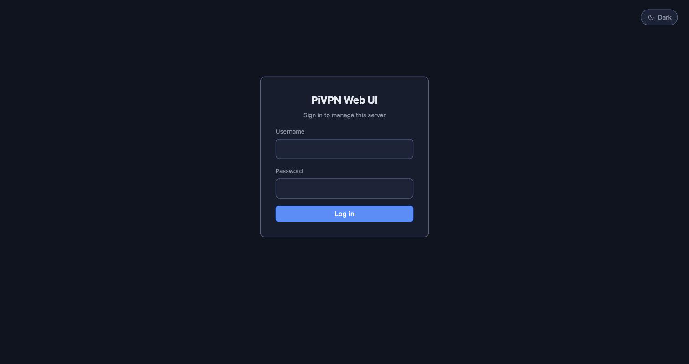
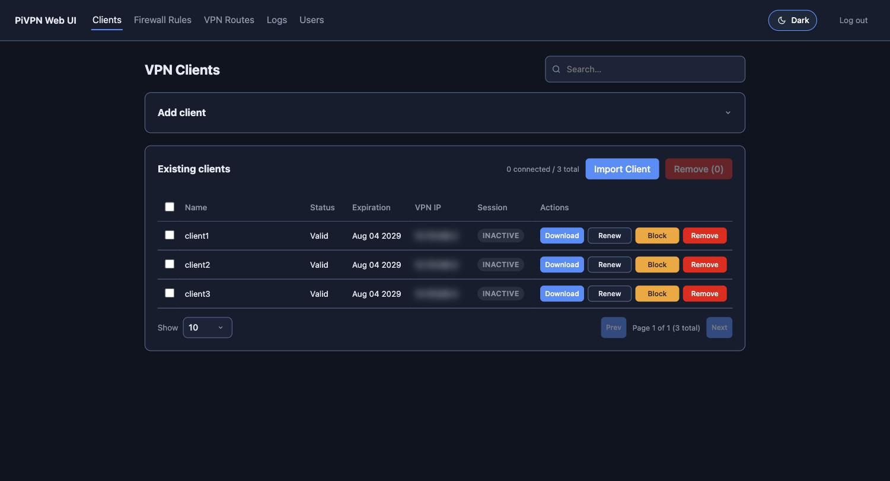
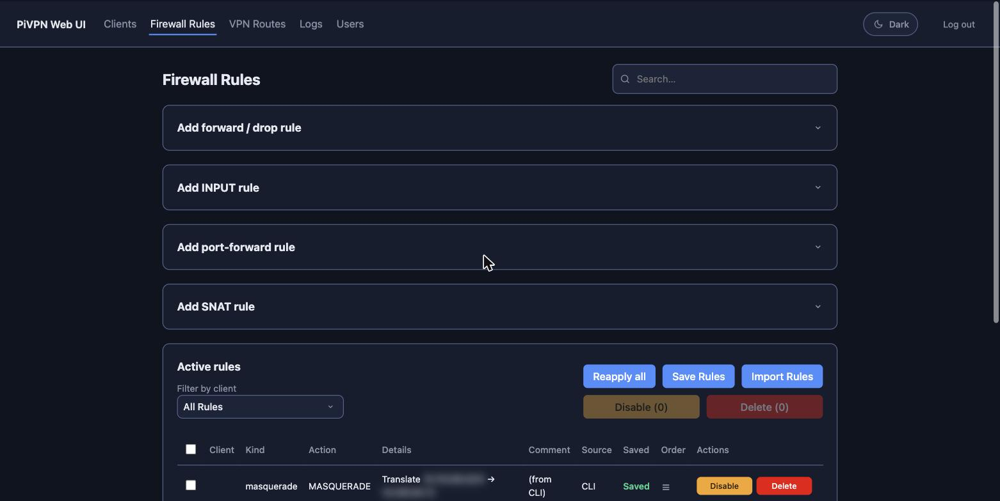
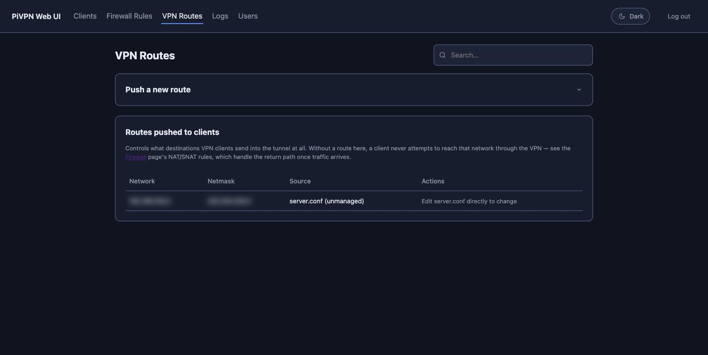
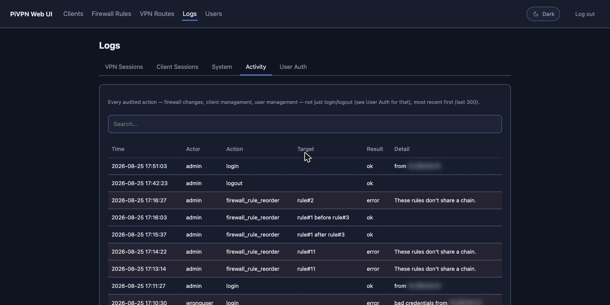
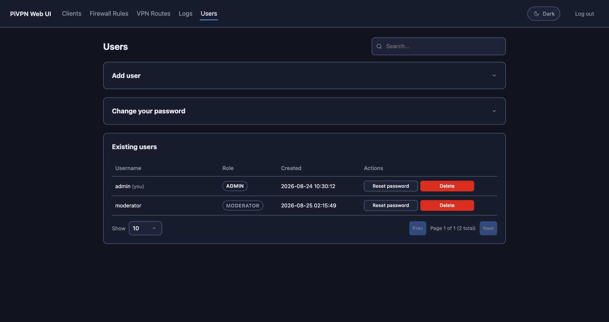
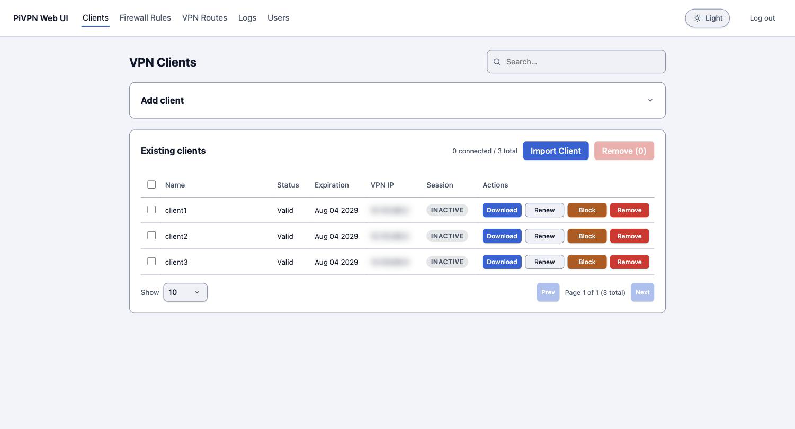

# PiVPN Web UI

A small Flask admin panel for a PiVPN (OpenVPN mode) install: create/renew/
remove VPN clients, download their `.ovpn` files, per-client block/unblock,
manage iptables FORWARD rules and DNAT port-forwards, control what
destinations get routed into the tunnel, view VPN/system/auth logs, and
manage multiple accounts with two roles (admin/moderator). Ships with a
manual-trigger CD pipeline (`git push` → `Deploy` button → live on the
server) for keeping a running install in sync with this repo.

## Screenshots

Dark theme (default) shown throughout, with one page in the light theme too —
both are available via a persisted toggle, see [Brand Commitments](DESIGN.md).
Data shown is from a disposable test install, not a real deployment; IP
addresses are blurred.

| | |
|---|---|
| **Login** | **Clients** |
|  |  |
| **Firewall Rules** | **VPN Routes** |
|  |  |
| **Logs — Activity** | **Users** |
|  |  |
| **Clients (light theme)** | |
|  | |

## What this actually does

- **Clients** page wraps the `pivpn` CLI:
  - *Add* → `pivpn add nopass -n <name> -d <days>`, or with `-p <pass>`
    instead of `nopass` for a password-protected cert. `-d`/`--days` is
    required for this to be non-interactive — without it, `makeOVPN.sh`
    falls back to a readline prompt for cert lifetime that just hangs under
    a non-interactive process. Defaults to PiVPN's own default (1080 days),
    overridable via `PIVPN_CERT_DAYS`.
  - *Download* → serves the `.ovpn` PiVPN wrote to `PIVPN_OVPN_DIR`.
  - *Renew* → **there is no native OpenVPN "renew" in PiVPN.** This does the
    standard workaround: revoke + reissue under the same name. The old
    `.ovpn` stops working the instant this runs; the client device needs the
    new file.
  - *Remove* → `pivpn revoke -y <name>` (non-interactive; PiVPN's newer
    subcommand is `revoke`, not `remove` — older docs/forks may differ).
  - *Block/Unblock* → inserts/removes a `DROP` rule matching that client's
    VPN IP in **both** `FORWARD` (stops it reaching anything past this
    server — LAN, internet) **and** `INPUT` (stops it reaching this server
    itself). Blocking is refused if the client's IP is the same address
    the request is coming from, to avoid cutting off your own access.
    PiVPN's own `add`/`revoke` scripts already pin and clean up a static
    per-client IP via client-config-dir (ccd) — this app only ever *reads*
    that (`get_client_ip`), it doesn't allocate IPs itself. A client only
    shows as blockable once it has a ccd entry, which PiVPN assigns at
    creation time.

- **Firewall** page manages several independent things, all stored in the
  Postgres database so they survive reapplication after reboot or an
  `iptables -F`:
  - General `FORWARD`-chain rules (protocol/source/dest/port → ACCEPT or DROP).
  - `INPUT`-chain rules — what's allowed to reach the server itself (the
    web UI, SSH, anything listening here), as opposed to FORWARD's
    "traffic passing through." A change that would block the admin's own
    current connection to the web UI (port 443/tcp) is refused server-side
    before it's applied, simulated against the live rule set in position
    order — see [Known limitations](#known-limitations--things-to-check)
    for the real, narrower scope of that guard.
  - DNAT port-forwards (external port → a VPN client's internal IP:port).
    Hard-refuses External port `443` or `22` — a port-forward's DNAT rule
    matches *any* incoming packet on the chosen port with no destination
    restriction, so forwarding one of these would silently redirect this
    app's own web UI (or SSH) traffic to the client instead of reaching
    this box. Can't cover whatever port OpenVPN itself listens on, though
    — see Known limitations.
  - SNAT/MASQUERADE rules (rewrite a subnet's outbound source address).
  - Both `INPUT` and `FORWARD` additionally hard-refuse a `DROP` rule with
    no source/destination/port set at all, any protocol — there's no
    legitimate reason for a rule that unrestricted, and there's a
    client-side warning for the same shape too, but only this server-side
    check can't be clicked through, skipped by disabling JS, or bypassed
    via bulk "Import Rules" (which routes through the same code as the
    Add-rule forms). Unlike the INPUT self-lockout guard above, this one
    is unconditional — it doesn't matter who's asking or what else is
    already in the table. Added after a live incident where exactly this
    shape of FORWARD rule took down VPN connectivity for every client.
  - "Apply Rules" reconciles iptables against the DB (idempotent — safe to
    click repeatedly). "Save for reboot" calls `netfilter-persistent save`,
    which requires `iptables-persistent` to be installed.
  - SNAT rules' "Outgoing interface" is a dropdown of the server's real
    network interfaces (`ip -o link show`, loopback excluded), not free
    text — populated live on each page load, so it always reflects
    whatever NICs actually exist on that box.
  - "Import Rules" detects one common mistake: a file in the *Clients*
    page's import format (`name=foo passphrase=bar` per line) uploaded
    here by accident, since both pages phrase their dialog the same way
    ("Import ... from file"). Instead of a generic "Unknown rule kind"
    error per line, it says so directly and points at the Clients page's
    Import Clients dialog instead.

- **VPN Routes** page manages `push "route ..."` lines in `server.conf` —
  what destinations get routed into the tunnel at all for every client
  (separate from the Firewall page's NAT/SNAT rules, which handle the
  return path once traffic arrives). Only ever adds/removes lines it
  tagged itself (`# pivpn-webui-route` marker) via
  `pivpn-webui-routes-helper.sh`; a route already in `server.conf` before
  the app touched it (e.g. added by hand) shows up read-only, tagged
  "unmanaged" — the page reflects `server.conf`'s real state either way,
  it just can't remove what it can't prove it created. Adding a route
  restarts the OpenVPN service to push it to clients.

- **Logs** page has five tabs:
  - *VPN Sessions* — raw client connect/disconnect events, best-effort
    parsed from the OpenVPN service journal (`app/vpnlog.py`).
  - *Client Sessions* — the same connect/disconnect events paired into
    per-client session records (when, how long, how many) instead of a raw
    event stream. A session still in progress shows "ongoing" with no end
    time yet.
  - *System* — raw tail of the `pivpn-webui` and system journals, for when
    you don't have SSH handy.
  - *Activity* — every audited action (firewall changes, client
    management, user management), not just login/logout — the full
    `app/db.py` `audit_log` table, unfiltered. Admin-only, for the same
    reason System is: it shows detail beyond what a moderator's "client
    control + who logged in" scope is meant to expose.
  - *User Auth* — login/logout history for every account, the same
    `audit_log` table filtered to just those two actions.
  Sessions and System both read via `pivpn-webui-log-helper.sh`, a second
  narrowly-scoped root helper (see below) — three fixed `journalctl`
  invocations, no caller-supplied arguments.

- **Users** page manages accounts — see
  [User accounts and roles](#user-accounts-and-roles) below for the full
  admin/moderator breakdown.

- **CRL permission watcher** (`fix-crl-perms.path`/`.service`, installed by
  `setup.sh`, running independently of the webui itself) — works around a
  real bug in PiVPN's own `removeOVPN.sh`: it regenerates
  `/etc/openvpn/crl.pem` via `cp -a`, which preserves Easy-RSA's restrictive
  `0600 root:root` source permissions. The unprivileged `openvpn` daemon
  can't read that, so every `pivpn revoke` (which *Renew* also triggers,
  via revoke+reissue) silently breaks **every** client's TLS handshake
  (`VERIFY ERROR: CRL not loaded`) until something re-`chmod`s the file. A
  `systemd` path unit watches `/etc/openvpn/crl.pem` and fixes it within
  about a second of any change, regardless of what triggered it (this app,
  raw CLI, cron) — see [Known limitations](#known-limitations--things-to-check)
  for the one thing to verify before trusting it on a different install.
  The fix service also has `StartLimitIntervalSec=0`: a *bulk* remove (many
  clients in quick succession) re-triggers the watcher once per revoke, and
  without this, systemd's default rate limit (5 starts/10s) would put the
  watcher itself into a permanent `failed` state after ~5 rapid triggers —
  silently leaving the CRL unreadable, breaking every VPN connection
  attempt, until someone runs `systemctl reset-failed` by hand. Hit this
  for real on a 6-client bulk remove; every trigger is just a harmless,
  idempotent `chmod`, so there's no real runaway-restart risk in disabling
  the limit entirely.

## ⚠️ Verified against one real install — other PiVPN versions may differ

The `pivpn_ctl.py` invocations (`add`/`revoke`/`list` flags, `pivpn list`'s
Status/Name/Expiration column order, the fact it always emits ANSI color
codes even when stdout isn't a tty, and that its first data row is always
the server's own cert) are confirmed against a real PiVPN OpenVPN install
(Ubuntu 22.04, PiVPN installed 2026-08-17 from github.com/pivpn/pivpn). If
your install is a different fork/vintage and something here doesn't match,
`pivpn -h` / `pivpn add -h` on the box shows the current syntax — only
`app/pivpn_ctl.py` needs to change, everything else (routes, templates,
firewall logic) is independent of it.

## Architecture

- Plain Flask app (`app/`), real accounts in a `users` table (`Flask-Login`)
  with two roles — admin and moderator, see "User accounts and roles"
  below.
- Runs as your normal user (the one that installed PiVPN), **not root** —
  `pivpn` itself refuses to run as root. It does, however, need passwordless
  sudo for its own internal privileged steps, same as it would if you were
  typing commands at an interactive prompt as the default Raspberry Pi OS
  `pi` user (which has NOPASSWD sudo out of the box — that's why PiVPN
  "just works" there and why a generic Debian/Ubuntu install needs an
  explicit grant; see `deploy/sudoers-pivpn-webui.template`). The handful of
  *other* operations that need root (iptables, reading ccd/status files,
  `journalctl`) go through this app's own `sudo -n` calls against the same
  explicit allowlist — see `app/privileged.py`. Nothing is ever
  shell-interpolated; all commands are built as argument lists.
- All state (firewall/port-forward rules, users, logs) lives in a
  **PostgreSQL** database — the DB is the source of truth, iptables is just
  where the firewall rules get applied. `setup.sh` provisions this
  automatically (installs PostgreSQL if missing, creates a dedicated role +
  database) — see Step 2 below.
- Can run two ways: **standalone** (this app + Postgres + PiVPN all on the
  same box, the original/default mode) or **hub + agent**, where the app
  and database run on a separate central machine and a small `agent.py`
  process on the PiVPN box dials out to it over an encrypted WebSocket —
  see [Hub/agent deployment](#hubagent-deployment-managing-the-vpn-server-remotely)
  below. `HUB_MODE=false` (unset, the default) is standalone; nothing about
  that mode changes by this feature existing.

## Complete setup, start to finish

Run this on the server PiVPN is installed on (Raspberry Pi, Ubuntu, or any
other Debian-based system), **as the user that installed PiVPN — not
root**. Debian/Ubuntu's base Python doesn't always ship the `venv` module —
if `./setup.sh` fails with "ensurepip is not available", run
`sudo apt install python3-venv` first, then retry.

The two sudo password prompts noted below are once per script run (sudo
caches your password for its default ~15 minutes), not once per command.
Zero iptables rules get added until you deliberately visit the Firewall
page in step 7 — everything before that is new files and process startup
only. See [Accessing it remotely](#accessing-it-remotely) and
[First login](#first-login) below for the full detail behind those steps.

**Step 1 — clone the repo** (on the box, as your normal sudo user, not root)

```bash
git clone https://github.com/vannyratanak/pivpn-webui.git
cd pivpn-webui
```

**Step 2 — run setup.sh** `[sudo password: 1x]`

```bash
./setup.sh
```

Creates `venv/`, installs Python deps, **installs PostgreSQL if missing and
provisions a dedicated database + role for this app** (re-running the
script rotates that role's password and updates `.env` to match — same
"re-running this script means starting fresh" behavior as the admin
credentials below), prompts for admin username/password ×2/ovpn dir/
OpenVPN subnet base, writes `.env` (chmod 600), sudo-installs the 4 helper
scripts + sudoers rule + systemd unit, and installs+starts the CRL
permission watcher (see below) — which starts running immediately,
protecting against a real PiVPN bug even before the webui itself starts.
Touches nothing PiVPN owns otherwise, no iptables, no VPN impact.

Before trusting the Sessions/System log tabs, verify the OpenVPN systemd
unit name matches what's hardcoded in the log helper:

```bash
systemctl list-units | grep openvpn
```

Compare against `OPENVPN_UNIT` in `deploy/pivpn-webui-log-helper.sh`.
Mismatch? Update that one file and reinstall:

```bash
sudo install -m 0750 -o root -g root deploy/pivpn-webui-log-helper.sh /usr/local/sbin/pivpn-webui-log-helper.sh
```

(Client add/remove/renew has the same kind of version caveat — see
"Verified against one real install" above, before this step.)

**Step 3 — start the service**

```bash
sudo systemctl enable --now pivpn-webui
```

gunicorn starts, binds `127.0.0.1:8443` only; creates every table in the
Postgres database Step 2 provisioned (`CREATE TABLE IF NOT EXISTS`, so this
is also what a later restart safely no-ops against); `sync_all()` runs but
the DB is empty so it does nothing. Still zero iptables rules at this point.

**Step 4 — put nginx + TLS in front of it** `[sudo password: 1x]`

```bash
./setup-nginx.sh
```

Installs nginx via apt if missing, prompts for a server name
(auto-detects your IP as the default), generates a self-signed cert (or
leaves a real one alone), installs the reverse-proxy vhost. Separate port
(443, admin panel) from OpenVPN's own tunnel port — zero effect on
connected VPN clients. Browse to `https://<server-name>/` once it's done.

**Step 5 — log in** with the admin username/password from Step 2.

**Step 6 — visit the Clients page first.** Read-only — runs `pivpn list` +
reads CCD files. Confirms the app sees your real clients correctly;
nothing is written.

**Step 7 — visit the Firewall page, at a quiet moment.**
`discover_cli_rules()` adopts every untagged rule it finds (e.g. PiVPN's
own MASQUERADE/FORWARD rules from the original install): delete → re-add
the same rule, now tagged. Sub-millisecond per rule, OpenVPN daemon never
touched. The table now shows everything found, marked "Unsaved."

**Step 8 — review the table, then click "Save Rules."** Locks the tagged
version in as what survives a reboot (needs `iptables-persistent`
installed).

✅ Fully installed.

Optional, separate from the above: if you want the `git push` → auto-deploy
CD pipeline too (not required for the app to work), see
[CD: deploying code changes to a running server](#cd-deploying-code-changes-to-a-running-server).

**Required for the Sessions / Client Sessions / Traffic tabs specifically**
(System/WebUI service log don't need this — they still read the journal
live, and that stays cheap even over a week): those three tabs read
pre-parsed rows from the database, populated by a background job, not a
live journalctl fetch — see
[Background log ingestion](#background-log-ingestion-sessionstraffic-history)
below. Until `./setup-log-ingest.sh` has been run at least once, those
three tabs show "no events found," same as any other not-yet-configured
feature in this app — nothing breaks, they're just empty.

## Hub/agent deployment (managing the VPN server remotely)

Everything above describes **standalone** mode: this app, its database, and
PiVPN all live on the same box. **Hub/agent** mode splits that in two — the
app + database run on a separate machine (the **hub**, e.g. a dedicated
server or your own laptop for testing), and a small, dependency-light
`agent.py` process runs on the actual PiVPN box (the **agent**) and dials
*out* to the hub over an encrypted WebSocket. Nothing on the agent box ever
needs an inbound port opened for this to work. This is the foundation for
eventually managing more than one PiVPN box from a single dashboard — today
it still only talks to one (`DEFAULT_SERVER_ID`), but the split itself is
what makes adding a second one later just a matter of registering it, not a
rearchitecture.

Every domain module (`app/firewall.py`, `app/pivpn_ctl.py`, ...) is written
as if it always runs locally — only a handful of primitives
(`app/privileged.py`'s `run_root`, `app/pivpn_ctl.py`'s `_run_pivpn`/
`read_client_ovpn`) know or care whether "locally" means this machine or
relayed to the agent. `HUB_MODE=false` (unset, the default) is standalone
mode and is completely unaffected by any of this.

### 1. On the hub — set up the app as normal, then add hub-specific config

Run `./setup.sh` on the hub machine exactly as in
[Complete setup](#complete-setup-start-to-finish) above (this provisions
its own Postgres — the hub's database, not the agent box's). Then add to
its `.env`:

```
HUB_MODE=true
DEFAULT_SERVER_ID=1          # matches the id manage_servers.py prints below
```

### 2. On the hub — turn on TLS for the agent-facing connection

```bash
./setup-hub-tls.sh
```

Generates a self-signed certificate (with a proper `IP:`/`DNS:` Subject
Alternative Name — a CN-only cert fails modern TLS hostname verification
even when the name is right) for `instance/hub-gateway.crt`/`.key`, and
prints the exact `.env` lines to add on the hub (`GATEWAY_TLS_CERT`/
`GATEWAY_TLS_KEY`) and on every agent (`HUB_URL=wss://...`,
`HUB_TLS_CERT=<path to the copied .crt>`). Only the `.crt` (public half)
ever needs to leave the hub — never copy the `.key` anywhere.

### 3. On the hub — register the agent box

```bash
python3 manage_servers.py register <name-for-this-box>
```

Prints a `server_id` and a one-time `token`. The raw token is shown exactly
once and only its hash is ever stored — write both down now, paste them
into the agent's own `.env` below. Lost the token? There's no recovery;
just register again under a new name.

### 4. On the hub — start both hub processes

Two separate long-running processes, not one — `hub_gateway.py` holds the
live WebSocket to every agent; the Flask app (gunicorn) talks to it over a
local Unix socket per request, not directly:

```bash
sed -e "s#__APP_DIR__#$(pwd)#g" -e "s/__USER__/$(whoami)/g" \
  deploy/pivpn-webui-hub-gateway.service.template | sudo tee /etc/systemd/system/pivpn-webui-hub-gateway.service >/dev/null
sudo systemctl daemon-reload
sudo systemctl enable --now pivpn-webui-hub-gateway
sudo systemctl enable --now pivpn-webui   # the normal Flask/gunicorn service from setup.sh
```

### 5. On the agent (the actual PiVPN box) — minimal install, no Postgres/nginx needed

The agent only ever needs `agent.py`, `config.py`, and the `app/` package
(for `pivpn_ctl.py`/`privileged.py`) — not the rest of the app, and
critically **not** its own Postgres:

```bash
git clone https://github.com/vannyratanak/pivpn-webui.git
cd pivpn-webui
python3 -m venv venv && source venv/bin/activate
pip install -r requirements.txt   # yes, the full list — `from app import pivpn_ctl` runs
                                   # app/__init__.py first (Flask, psycopg2 and all), even
                                   # though agent.py itself never uses most of it at runtime
```

Copy the hub's cert (from step 2) to this box, then write this box's own
`.env` (**not** the hub's — different values entirely on this side):

```
HUB_URL=wss://<hub's address>:8765
AGENT_SERVER_ID=<the id manage_servers.py printed>
AGENT_TOKEN=<the token manage_servers.py printed>
HUB_TLS_CERT=<path where you copied the hub's .crt>
PIVPN_OVPN_DIR=/home/<user>/ovpns
```

The agent needs its own, narrower sudoers grant — just what `agent.py`
itself calls, none of the standalone/hub template's CD-deploy-specific
lines (there's no Flask service on this box to restart). Validate before
installing, same as `setup.sh` does for the standalone case, not after —
a syntax error caught only once the file is already live in
`/etc/sudoers.d/` is a much worse time to find it:

```bash
SUDOERS_TMP="$(mktemp)"
sed -e "s/__USER__/$(whoami)/g" deploy/sudoers-pivpn-webui-agent.template > "$SUDOERS_TMP"
sudo visudo -cf "$SUDOERS_TMP"
sudo install -m 0440 -o root -g root "$SUDOERS_TMP" /etc/sudoers.d/pivpn-webui-agent
rm -f "$SUDOERS_TMP"
```

Then install it as a service and start it:

```bash
sed -e "s/__USER__/$(whoami)/g" -e "s#__APP_DIR__#$(pwd)#g" \
  deploy/pivpn-webui-agent.service.template | sudo tee /etc/systemd/system/pivpn-webui-agent.service >/dev/null
sudo systemctl daemon-reload
sudo systemctl enable --now pivpn-webui-agent
```

**Verify**: `sudo journalctl -u pivpn-webui-agent -n 20` should show
`connected to hub as server #<id>`; the hub's own
`sudo journalctl -u pivpn-webui-hub-gateway -n 20` should show the matching
`agent for server #<id> connected`. Then log into the hub's web UI and
visit Clients — it should show this box's real clients.

### Reaching the hub's web UI itself

The hub's Flask app still only speaks plain HTTP on its own
(`gunicorn`/`wsgi.py` never terminate TLS by default) — see
[Accessing it remotely](#accessing-it-remotely) below for the normal
nginx-in-front option. For quickly reaching it from a phone/tablet on the
same network without setting up nginx first, `wsgi.py` (the plain
`python3 wsgi.py` dev-server path, not gunicorn) can terminate TLS itself
with a self-signed cert:

```
BIND_HOST=0.0.0.0
BIND_TLS_CERT=/path/to/instance/webui.crt
BIND_TLS_KEY=/path/to/instance/webui.key
```

Generate that cert the same way as `setup-hub-tls.sh` does (see that
script), just for the hub's own LAN address instead of the agent
connection. For anything beyond quick testing, prefer gunicorn +
`--certfile`/`--keyfile` (or nginx) over the plain dev server — see
[Database concurrency and gunicorn workers](#database-concurrency-and-gunicorn-workers)
for why the dev server alone doesn't hold up under more than one client at
a time even with `threaded=True`: it does each new connection's TLS
handshake in its single accept loop, before handing off to a thread, so
one slow/incomplete handshake blocks every other client until it resolves.

## Accessing it remotely

It's bound to localhost on purpose — this panel can revoke certs and edit
your firewall, so it shouldn't be reachable from the internet without more
thought than a weekend project gets. Options, easiest first:

- **SSH tunnel**: requires `./setup-nginx.sh` to already be set up (nginx is
  what actually speaks TLS — gunicorn itself never does, see below), then
  `ssh -L 8443:127.0.0.1:443 youruser@yourserver` (note: remote port
  **443**, nginx's port — not `BIND_PORT`/8443, gunicorn's own plain-HTTP-
  only port). Browse to `https://127.0.0.1:8443` from your laptop.
  Simplest, no extra exposure.
- **LAN-only**: set `BIND_HOST=0.0.0.0` in `.env`, restart the service, and
  add a host-firewall rule scoping port `BIND_PORT` to your LAN subnet
  specifically — don't just open the bind address and rely on there being
  no route from further out. Plain traffic, no auth beyond the app's login,
  so only do this on a network you trust. Also set `SESSION_COOKIE_SECURE=false`
  in `.env` for this mode — the cookie a login issues is marked
  HTTPS-only by default, so over plain HTTP it would never come back on
  the next request and login would look like it silently fails
  (redirect-loops back to `/login`):
  ```bash
  sudo iptables -A INPUT -p tcp --dport 8443 -s 192.168.1.0/24 -j ACCEPT
  sudo iptables -A INPUT -p tcp --dport 8443 -j DROP
  sudo netfilter-persistent save   # survive reboot
  ```
- **Reverse proxy with TLS** in front of it — the real move if this needs to
  be reachable beyond a LAN you already trust. `./setup-nginx.sh`
  installs nginx if needed, generates a self-signed cert (or leaves an
  existing one at `/etc/nginx/ssl/pivpn-webui.{crt,key}` alone if you
  supplied a real one first), and installs the reverse-proxy vhost. Add its
  own auth layer in front too if you want defense in depth. Caddy is a fine
  alternative if you prefer it, just not what this script automates.
- This app never serves HTTPS itself — anything beyond the SSH-tunnel option
  is sending the login password in plaintext unless you put TLS in front.

## Real client IPs behind a relay (optional)

Only relevant if this server's real OpenVPN traffic is relayed through
another box — e.g. because this server can only reach the internet on
TCP/443 and dials out through a public relay that forwards/MASQUERADEs
real VPN clients in. In that setup, every connection this server's own
OpenVPN log sees is stamped with the *relay's* tunnel-facing address
(e.g. `10.66.66.1:<port>`), not the client's real internet address — the
MASQUERADE rule that lets return traffic route back through the tunnel
necessarily relabels it that way. **If you're not relaying traffic through
another box, skip this whole section** — `RELAY_HOST`/`RELAY_TUNNEL_IP`
default to unset, and `resolve_real_address()` in `app/vpnlog.py` returns
`None` immediately without ever touching `ssh`, so Client Sessions behaves
exactly as it always has.

### How it works

The relay's own connection-tracking table (`conntrack`) still remembers
the real `(client IP, client port)` behind each masqueraded connection,
for as long as that connection stays open. This server asks for that
mapping over SSH, using a key that's restricted to running exactly one
lookup script and nothing else — the relay may be a shared box hosting
other, unrelated services, so this is deliberately not full root/shell
access from here.

### One-time setup on the relay

1. Install `conntrack-tools` (`apt install conntrack-tools`) and the
   lookup script at `/usr/local/sbin/vpn-real-ip.sh` (`chmod 755`):

   ```bash
   #!/bin/bash
   set -euo pipefail
   PORT="${1:?usage: $0 <port-from-openvpn-log>}"

   conntrack -L -p udp --dport 1194 2>/dev/null | awk -v want="dport=$PORT" '
     {
       seen = 0
       for (i = 1; i <= NF; i++) {
         if ($i ~ /^dport=/) {
           seen++
           if (seen == 2 && $i == want) {
             gsub(/src=/, "", $4)
             gsub(/sport=/, "", $6)
             print $4":"$6
             found = 1
           }
         }
       }
     }
     END { if (!found) exit 1 }
   '
   ```

   Adjust `--dport 1194` if the relay forwards a different UDP port.

2. Install a forced-command wrapper at
   `/usr/local/sbin/vpn-real-ip-wrapper.sh` (`chmod 755`) — this is the
   actual security boundary the restricted key below relies on, not the
   key itself, so it validates the incoming command tightly rather than
   trusting `authorized_keys` option-globbing:

   ```bash
   #!/bin/bash
   set -euo pipefail
   if [[ "${SSH_ORIGINAL_COMMAND:-}" =~ ^/usr/local/sbin/vpn-real-ip\.sh\ ([0-9]{1,5})$ ]]; then
     exec /usr/local/sbin/vpn-real-ip.sh "${BASH_REMATCH[1]}"
   fi
   echo "rejected: only vpn-real-ip.sh <port> is permitted" >&2
   exit 1
   ```

### One-time setup on this server (the OpenVPN box)

1. Generate a dedicated key — don't reuse the CD deploy key from the
   section below, this one needs different, narrower permissions:
   ```bash
   ssh-keygen -t ed25519 -f ~/.ssh/relay_lookup_key -N '' -C 'thisserver-to-relay-real-ip'
   ```
2. On the relay, add the **public** half to `root`'s `authorized_keys`
   with a forced command pointing at the wrapper above. **The quotes
   around the `command=` value are required** — an unquoted value is
   silently rejected by `sshd` with nothing useful in the log at default
   verbosity (cost real debugging time to track down once already):
   ```
   command="/usr/local/sbin/vpn-real-ip-wrapper.sh",no-port-forwarding,no-X11-forwarding,no-agent-forwarding,no-pty ssh-ed25519 AAAA... thisserver-to-relay-real-ip
   ```
3. `resolve_real_address()` calls plain `ssh user@host script port` with
   no `-i` flag, so point it at the right key via `~/.ssh/config`, set up
   as the same user the `pivpn-webui` service runs as (check `User=` in
   `/etc/systemd/system/pivpn-webui.service`):
   ```
   Host <relay's public IP>
     User root
     IdentityFile ~/.ssh/relay_lookup_key
     IdentitiesOnly yes
     StrictHostKeyChecking accept-new
   ```
4. Add to `.env` and restart the service:
   ```
   RELAY_HOST=<relay's public IP>
   RELAY_TUNNEL_IP=<relay's tunnel-facing IP, e.g. 10.66.66.1>
   RELAY_SSH_USER=root
   ```
   (`RELAY_LOOKUP_SCRIPT` only needs setting if the script isn't at the
   default `/usr/local/sbin/vpn-real-ip.sh`.)
5. Verify: with a client actually connected, note its port from
   `sudo cat /var/log/openvpn-status.log`, then from this server run:
   ```bash
   ssh root@<relay's public IP> /usr/local/sbin/vpn-real-ip.sh <port>
   ```
   It should print `real.ip.address:port`. If it does, the Client
   Sessions tab will show it too — but only for sessions still ongoing;
   `conntrack` forgets the mapping the moment a client disconnects, so an
   already-ended session always falls back to showing the relayed
   address, same as before this feature existed.

## Background log ingestion (Sessions/Traffic history)

`./setup-log-ingest.sh` (run once, after `setup.sh`) installs a systemd
timer that runs `deploy/ingest_logs.py` every 10 seconds. That script pulls
whatever's new since its last run (via `journalctl --cursor-file`, so each
run only ever sees new lines, never re-scans the whole window) and stores
it as structured rows in the app's own database — `vpn_events` (OpenVPN
connect/disconnect/other lines, including a `real_address` resolved once
per connect — see `resolve_real_address`) and `traffic_flows`
(per-connection Traffic-tab rows, with destination org + client name
already resolved). The Sessions, Client Sessions, and Traffic tabs then
just read those tables directly.

Each of those tabs also has a **Refresh now** button
(`POST /logs/refresh`) that runs one ingestion cycle immediately instead
of waiting for the next timer tick — useful right after connecting a
client yourself and wanting to see it show up without a wait. It calls the
exact same `ingest_vpn_events`/`ingest_traffic_flows` functions the timer
does; running it early doesn't skip, duplicate, or conflict with the
timer's own next run (the journal cursor plus each table's `INSERT OR
IGNORE` already make ingestion safe to run at any time, from anywhere).

**Why this exists, not just a wider `--since` window**: journald itself
already keeps well over a week of history by default (confirmed live: a
month+ on one real install, only ~128MB) — the original 3-day/6-hour
windows in `pivpn-webui-log-helper.sh` were never a real data limit, just
an arbitrary choice. But `app/vpnlog.py` regex-parses every raw line of
Sessions/Traffic on each page load (pairing connect/disconnect events,
matching the kernel's flow-log format, resolving WHOIS) — measured live at
~1.5s (Sessions, ~13k lines/week) to ~4s+ (Traffic, thousands of
lines/day) once the window's widened to a week. Moving that parsing out
of the request path and into a background job removes that cost entirely
from every page load, at the price of up to ~10s of lag (the timer
interval) before a brand-new session/flow shows up — or none at all, if
you click Refresh now.

**Retention**: both tables are pruned to the last 7 days on every ingest
run (`db.prune_old_logs`). Change `RETENTION_DAYS` in
`deploy/ingest_logs.py` for a different window — there's no separate
config flag for it.

**Duplicate-safety**: confirmed live that `journalctl --cursor-file` can
re-emit the same last-seen line on the very next invocation. Both tables
have a `UNIQUE` constraint over their real-world identifying columns and
ingestion uses `INSERT OR IGNORE`, so reprocessing the same line twice is
a silent no-op, not a duplicate row.

**Updating it later**: `ingest_logs.py` runs straight from the git
checkout (not copied elsewhere), so a normal `git pull`/CD deploy picks up
changes to it automatically on the next scheduled run — no separate
reinstall step, unlike the 4 helper scripts below. The systemd unit files
themselves (`pivpn-webui-log-ingest.service`/`.timer`) are static and
aren't part of the CD forced command; reinstall them by hand
(`sudo install ...` + `sudo systemctl daemon-reload`) if you ever change
those specifically.

## Database concurrency and gunicorn workers

**PostgreSQL handles concurrent reads/writes natively** (MVCC — a write in
progress, e.g. the ingestion job running every 10s, never makes a
concurrent read wait its turn, and vice versa) — nothing app-side to
configure for that, unlike the SQLite-era `WAL` pragma this section used to
describe before the Postgres migration.

One change still matters for throughput under load:

- **gunicorn runs threaded workers**: `-w 2 --worker-class gthread
  --threads 4` (was `-w 2` alone) in `pivpn-webui.service.template` — still
  2 separate worker *processes* (same crash/fault isolation as before),
  each one now able to juggle several in-flight requests via threads
  instead of blocking on one at a time. This app is almost entirely
  I/O-bound (`pivpn`, `iptables`, `journalctl`, WHOIS, SSH to the relay all
  release Python's GIL while waiting), which is exactly the case threads
  help with.

**Real numbers, not estimates** (⚠️ measured before the SQLite→PostgreSQL
migration — directionally still useful, not re-measured against Postgres
yet) — measured live against an isolated throwaway database on a real
install (never the production DB; deleted after), simulating a
steady-state, heavily-loaded scenario (100 clients, ~4,880 flow rows/hour
each, 7-day retention → ~4.88M rows):

| Operation | Time |
|---|---|
| Insert one ingestion tick's worth of new rows (1,355) into the full 4.88M-row table | 0.042s |
| Read query the Traffic tab actually runs (`ORDER BY ts DESC LIMIT 300`) | 0.024s |
| Prune a large catch-up batch (360,000 rows crossing the 7-day boundary at once) | 7.1s |
| Database file size at 4.88M rows | 1,019 MB (219 bytes/row, measured) |

The prune number needs a caveat: that's a big one-time catch-up delete,
not the steady-state case — in normal operation, pruning runs every tick
and only removes whatever just crossed the 7-day mark *that tick*
(comparable in size to one tick's insert, so it should be fast like the
insert number above, not the catch-up number). The catch-up case only
shows up after real downtime (ingestion stopped for a while, then resumes
and has a backlog to prune).

Also checked live, while that same test was bulk-loading data (real CPU/
memory/disk-wait numbers, not assumptions): CPU-wait-on-disk (`wa` in
`top`) stayed at 0.0% throughout — for this workload, disk I/O was never
the bottleneck; the test script's own CPU-bound Python row generation was.
Real ingestion does far less per-row Python work than that synthetic
generator, so actual production load should sit comfortably below it.

**Disk space, not database performance, is the real scaling question.**
At the same ~4.88M-rows/10-hours scenario sustained daily with 7-day
retention: ~34M rows × 219 bytes/row ≈ **~7.5GB**. Check free disk before
assuming this is fine at your real client count and usage pattern — this
isn't something the app can safely assume for you.

## CD: deploying code changes to a running server

This repo is public and its `Deploy` workflow runs on a **self-hosted**
runner (has to — the deploy targets are private-network addresses no
GitHub-hosted runner can reach). That combination is normally the classic
"fork a public repo, open a PR, get code execution on someone's runner"
risk — it doesn't apply here because `deploy.yml`'s only trigger is
`workflow_dispatch`, which requires the invoker to already have write
access to the repo; a stranger's fork PR can't make it run. Fork PR
workflows are also disabled repo-wide as a second, independent layer
(Settings → Actions → General → "Run workflows from fork pull requests"),
so even a future workflow added with a `pull_request` trigger by mistake
wouldn't run from a fork without that box being checked first. Deploy
targets and the SSH username live in GitHub secrets (`DEPLOY_TARGET_1`,
`DEPLOY_TARGET_2`, ... — one per server, sequentially numbered), not
hardcoded in the workflow file, so nothing about the network layout is
visible to a public reader either.

`.github/workflows/deploy.yml` is a **manual-trigger only** workflow
(`workflow_dispatch` — nothing runs automatically on push, only `CI`/tests
do). Running it from GitHub Actions SSHes into each configured server with
a dedicated deploy key; each server's `authorized_keys` entry has a
**forced command** on that key, so whatever the workflow actually sends is
ignored — the server always runs exactly this, regardless:

```
cd <app dir> && git pull \
  && sudo -n install -m 0750 -o root -g root deploy/pivpn-webui-ccd-helper.sh /usr/local/sbin/pivpn-webui-ccd-helper.sh \
  && sudo -n install -m 0750 -o root -g root deploy/pivpn-webui-log-helper.sh /usr/local/sbin/pivpn-webui-log-helper.sh \
  && sudo -n install -m 0750 -o root -g root deploy/pivpn-webui-routes-helper.sh /usr/local/sbin/pivpn-webui-routes-helper.sh \
  && sudo -n install -m 0750 -o root -g root deploy/pivpn-webui-client-script-helper.sh /usr/local/sbin/pivpn-webui-client-script-helper.sh \
  && sudo -n systemctl restart pivpn-webui
```

**Why the reinstall steps matter**: `git pull` alone only updates files
inside the repo checkout. It does **not** touch `/usr/local/sbin/` —
only `setup.sh` (or this forced command) does that. A change to any of the
4 privileged helper scripts would silently never take effect through
Deploy without this — the workflow would report success while the live
server kept running the old script. Hit this for real once; it's why the
reinstall steps exist.

### Adding a new server to this pipeline

1. `./setup.sh` on the server as usual — the sudoers grants for the
   `sudo -n install ...` calls above are included automatically (they
   need `__APP_DIR__` substituted to that server's real checkout path,
   which `setup.sh` now does).
2. `./setup-cd-deploy.sh` — installs the forced-command deploy key.
   Prompts for the public key; use the same one already on other servers
   (`grep -oP 'ssh-ed25519 \S+ github-actions-deploy@pivpn-webui'
   ~/.ssh/authorized_keys` on an existing server) so one GitHub secret
   covers every server. **Not idempotent for updates** — if a server
   already has this key installed, the script detects the exact key
   string and skips, even if the forced command itself should change
   (e.g. after a future edit to the reinstall-steps list above). Remove
   the old `authorized_keys` line by hand first if the command itself
   needs to change on an already-configured server.
3. Add a new GitHub Actions secret for this server (`gh secret set
   DEPLOY_TARGET_2 --body "vpn@<its IP>"` — same `user@host` format as
   the existing `DEPLOY_TARGET_1`, keeps real IPs and usernames out
   of the workflow file itself, so `deploy.yml` stays safe to read in a
   public repo). Then add a matching `- name: Deploy to target 2` step to
   `.github/workflows/deploy.yml`, copying the existing step's pattern
   (same deploy key, `${{ secrets.DEPLOY_TARGET_2 }}` for the host).
4. Before trusting the button: manually run the exact forced-command
   sequence over SSH once (steps 1-2 above, pasted directly) — this is
   the one thing worth verifying by hand rather than assuming, since a
   path mismatch between the sudoers grant and the forced command fails
   silently as "needs a password" rather than a clear error.

## First login

1. Log in with the admin username/password you set during `./setup.sh`.
2. **Visit Clients first.** It's read-only — just `pivpn list` plus a CCD
   read — a safe first check that the app can see your real clients before
   you touch anything that writes.
3. **Visit Firewall next, at a quiet moment rather than peak VPN usage.**
   The first time this page loads, it scans your live iptables (`FORWARD`,
   `INPUT`, and the `nat` table's `PREROUTING`/`POSTROUTING` chains) for any
   rule that isn't already tagged `pivpn-webui:<id>` — on a box that's never
   run this app before, that includes whatever PiVPN's own installer set up
   (its `MASQUERADE`/`FORWARD` rules) plus anything added by hand over the
   years. Each one gets adopted: recorded into the app's database, then
   deleted and immediately re-added with the same match and action, just
   now tagged. It's a live iptables write, but a same-rule swap, not a
   behavior change — the OpenVPN daemon itself is never touched or
   restarted, so connected clients' tunnels aren't affected. A rule shape
   the parser doesn't recognize (`REJECT`, `LOG`, an unusual multi-match
   rule) is left alone entirely — it keeps working, it just never shows up
   in this app's table.
4. **Review the Active Rules table against what you expect to be there,
   then click "Save Rules."** Everything just discovered shows as
   "Unsaved" until you do — that button persists the newly-tagged version
   into the reboot-survival snapshot (`netfilter-persistent save`, so
   `iptables-persistent` needs to be installed). Skip this and a reboot
   brings back the original untagged rules, which just get rediscovered
   (and re-tagged with fresh IDs) the next time you visit.

## User accounts and roles

The admin username/password from `./setup.sh` becomes the first real
account the first time the app starts (`app/db.py`'s `init_db()` carries
it over from `.env` into a `users` table automatically — no manual step).
From there, add more accounts from the **Users** page:

- **Admin**: full access — everything a single admin had before this
  feature existed, plus managing other accounts.
- **Moderator**: the Clients page, and only the Client Sessions + Auth
  tabs on the Logs page. No Firewall, no VPN Routes, and read-only on the
  Users page (sees who else has access, can't add/delete/reset anyone's
  password).

Any account can change its own password from the Users page — that one
specifically asks for your current password first, since it's the
self-service path a stolen session cookie could otherwise abuse to
silently take over the account. An admin resetting *someone else's*
password doesn't need their current password, since the admin is already
a separate authenticated party.

Deleting a user is blocked in two cases: the account you're currently
logged in as (avoids a confusing mid-session logout), and the last
remaining admin account (would leave nobody who can create a replacement
admin, manage the firewall, or do anything else admin-only again).

## API access (JWT)

Besides the browser UI, every action in this app is also reachable as a
JSON API (`app/api.py`) for scripts or another system to call without a
browser — get a short-lived token, then use it as a bearer credential:

```bash
curl -s -X POST https://<host>/api/login \
  -H "Content-Type: application/json" \
  -d '{"username": "admin", "password": "..."}'
# -> {"access_token": "...", "role": "admin", "expires_in_minutes": 15}

curl -s https://<host>/api/clients \
  -H "Authorization: Bearer <access_token>"
```

Tokens expire in 15 minutes by default (`JWT_ACCESS_TOKEN_MINUTES` in
`.env`) — deliberately short, so a token that leaks (logged somewhere,
committed to a script by accident) self-expires quickly instead of
staying valid indefinitely. `JWT_SECRET_KEY` is a separate secret from
`SECRET_KEY` (falls back to it if unset) so rotating one doesn't force
rotating the other.

Endpoints mirror the browser pages 1:1, with the same role gating
(admin-only where the equivalent page is admin-only):

| Area | Endpoints |
|---|---|
| Auth | `POST /api/login` |
| Clients | `GET/POST /api/clients`, `GET /api/clients/<name>`, `POST /api/clients/<name>/renew`, `DELETE /api/clients/<name>`, `GET /api/clients/<name>/download`, `POST /api/clients/<name>/block`, `POST /api/clients/import`, `POST /api/clients/bulk-remove` |
| Per-client rules | `GET/POST /api/clients/<name>/rules`, `POST .../rules/<id>/toggle`, `DELETE .../rules/<id>`, `POST .../rules/resync\|persist\|bulk-disable\|bulk-delete` |
| Firewall (admin) | `GET /api/firewall/rules`, `GET /api/firewall/options`, `POST /api/firewall/forward\|input\|snat\|portforward`, `POST /api/firewall/rules/<id>/toggle`, `DELETE /api/firewall/rules/<id>`, `POST /api/firewall/rules/<id>/reorder`, `POST /api/firewall/import\|resync\|persist\|bulk-disable\|bulk-delete` |
| VPN Routes (admin) | `GET/POST/DELETE /api/vpn-routes` |
| Logs | `GET /api/logs?tab=...`, `POST /api/logs/refresh` |
| Users | `GET/POST /api/users`, `DELETE /api/users/<id>`, `POST /api/users/<id>/reset-password` (admin except list/your own password), `POST /api/account/password` |

`app/api.py` is the source of truth for exact request/response shapes —
each endpoint's docstring says which browser view it mirrors.

The browser loads page data and submits management actions through the
same bearer API, including imports, bulk actions, downloads, and firewall
reordering. Tables show loading skeletons while fetching data. Import
endpoints accept multipart files and return JSON, including individual
failures when only part of an import succeeds.

Login issues an HttpOnly JWT cookie for page navigation. JavaScript obtains
its bearer token from the cookie-authenticated `/account/api-token`
endpoint and stores it in localStorage. An expired bearer token is refreshed
once and the request retried while the browser session is still valid.
Because localStorage is accessible to page scripts, protecting against XSS
remains essential. A new login invalidates earlier tokens for that account; logging out also
revokes the bearer tokens issued during that session.

After **90 seconds without activity** (`IDLE_TIMEOUT_MINUTES=1.5`), the browser
returns to login. Activity extends that deadline through periodic
heartbeats, and activity in another tab counts too. A countdown appears in
the last 10 seconds before idle logout; ordinary bearer-token refresh does not
trigger a logout warning. The server also rejects browser cookies whose
last recorded activity has exceeded the idle window. `SESSION_LIFETIME_HOURS`
controls the cookie's longer sliding expiry.

## Known limitations / things to check

- The INPUT self-lockout guard only ever protects **the requester's own
  current connection to port 443/tcp** — not other services on the box
  (SSH, OpenVPN's own listening port), and not anyone else's access. It
  also simulates rules in position order, so if an earlier `ACCEPT` rule
  already covers your IP, a new unrestricted `DROP` you add after it
  passes the check even though it's still catastrophic for everyone/
  everything it applies to first — this is exactly what let a real
  `DROP`-all-udp INPUT rule take down every VPN client's OpenVPN
  connection while the admin's own web UI access kept working. The
  separate, unconditional guard against a blank-source/blank-port `DROP`
  (on both `INPUT` and `FORWARD`) exists specifically to not depend on
  this simulation at all.
- Rule **discovery** (`discover_cli_rules`, run when connecting to a
  server with pre-existing iptables rules) and **"Apply Rules"**
  (`sync_all`) both read/write the DB directly and don't go through any
  of the guards above — by design, since they have to faithfully mirror
  whatever's already live or already recorded, not gatekeep it. A
  dangerous rule that already exists on a server before this app manages
  it (blanket `DROP`, or the port-forward hijack noted below) will be
  imported/reapplied silently, with no flag or warning — it just shows up
  in the Active Rules table like any other rule. Worth a manual look at
  a fresh server's Active Rules list after first sync.
- **Port-forward rules hard-reject External port `443` or `22`** — the
  DNAT rule they create matches *any* incoming packet on the chosen
  external port/protocol, with no restriction on which destination it
  applies to, so forwarding one of these would silently redirect *all*
  traffic on that port away from the box itself (this app's own web UI,
  or SSH) instead of making it reachable — same severity as the
  INPUT/FORWARD DROP gaps above, just via redirect instead of drop. This
  guard can't cover **whatever port OpenVPN itself listens on**, though —
  that's only knowable by reading `server.conf`, which this check doesn't
  do; be careful forwarding a port you're not sure is free. SNAT rules
  have a smaller, still-open version of the same looseness: leaving
  Source blank rewrites the exit address for *all* outbound traffic on
  that interface, not just VPN clients' traffic.
- **An `ACCEPT` FORWARD rule only does something if your FORWARD chain's
  default policy is `DROP`.** This app never sets that policy itself —
  it's whatever the box already has (`iptables -L FORWARD -n -v` shows it
  on the "Chain FORWARD (policy ...)" line). If the default is already
  `ACCEPT` (common on an install that's never had it explicitly locked
  down), every destination is already reachable through the box
  regardless of any `ACCEPT` rule you add or remove here — only a `DROP`
  rule actually restricts anything in that case. Confirmed live: adding,
  then disabling, an `ACCEPT` FORWARD rule for a test destination made no
  observable difference to whether it was reachable, because the
  underlying chain was `ACCEPT`-by-default with no other rules the whole
  time. Check your own chain's policy before assuming an `ACCEPT` rule
  here is the thing making something reachable.
- Only two roles exist (see "User accounts and roles" above), no
  finer-grained permissions or team/org hierarchy beyond that split yet.
- Changing a password (self-service or an admin's reset) doesn't
  invalidate that account's *other* already-open sessions elsewhere —
  there's no server-side session store to revoke against with Flask's
  plain cookie sessions, only the account whose password changed needs
  to log back in anywhere it matters.
- Login is rate-limited (5 failed attempts / 5 minutes, per source IP —
  see `app/db.py`'s `login_failures` table) and sessions expire after
  `SESSION_LIFETIME_HOURS` (default 8) of inactivity — a sliding window,
  renewed on every request, not a fixed timer from login time. Both exist
  because a relay setup (see below) can put the login page on the public
  internet; tune `SESSION_LIFETIME_HOURS` in `.env` if 8 hours doesn't
  match how this install is actually used.
- `renew_client` fully revokes before reissuing — it's not atomic (revoke
  can't be undone), so if `add_client` then fails afterward (e.g. a server
  resource hiccup), the client is left with no valid cert at all, not just
  stuck on the old one. The UI makes this unambiguous rather than showing
  an ordinary-looking error: a distinct message ("...this client now has
  NO valid VPN access — re-add it manually") and a separate
  `client_renew_partial` audit-log entry, so it doesn't blend in with a
  routine renew failure.
- Per-client block needs a ccd-assigned IP, which PiVPN only writes once a
  client has been through `add`. Clients created before this tool (or before
  PiVPN itself added ccd pinning, if you're on an old version) may show no
  IP and thus no block/unblock option until renewed.
- `add_portforward_rule` opens the DNAT target as ACCEPT in FORWARD for that
  IP:port — it does not also open your router's WAN port; if this server
  isn't your edge device, you still need a port-forward on whatever
  actually faces the internet.
- VPN Sessions tab parsing is best-effort: it depends on OpenVPN's log line
  format, which isn't strictly standardized. Unrecognized lines still show
  up (event "other", raw text in Detail) rather than being silently dropped.
  Client Sessions pairs the same parsed events, so it inherits the same
  fragility — a missed connect/disconnect line there shows as a session
  with no matching end (or start) rather than a wrong duration.
- If you installed this app before the Logs page existed, rerun the two
  `sudo install ...pivpn-webui-log-helper.sh...` / sudoers steps from
  `setup.sh` manually, or just rerun `./setup.sh` — it's safe to re-run.
- The CRL permission watcher assumes PiVPN's default `crl-verify` path,
  `/etc/openvpn/crl.pem` — check `crl-verify` in `/etc/openvpn/server.conf`
  matches on your install; if it doesn't, update `PathModified` in
  `deploy/fix-crl-perms.path` and reinstall
  (`sudo install -m 0644 deploy/fix-crl-perms.path
  /etc/systemd/system/fix-crl-perms.path && sudo systemctl daemon-reload
  && sudo systemctl restart fix-crl-perms.path`).
